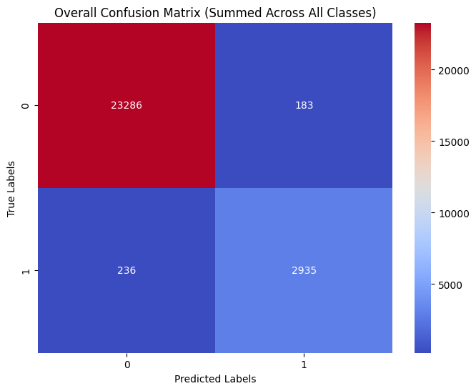
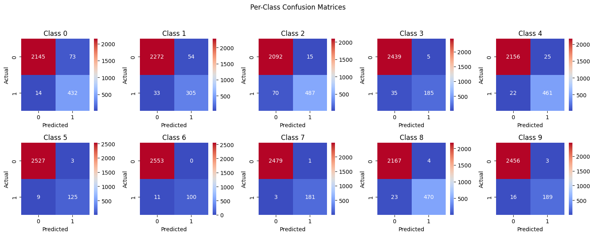

# **Multi-Label Image Classification with ResNet**
## **Project Overview**
This project focuses on **multi-label image classification** using a **ResNet-based deep learning model**. The goal is to develop a robust system that can accurately classify images into multiple categories simultaneously. The project involves a complete **end-to-end pipeline**, including **data preprocessing, model training, hyperparameter tuning, and performance evaluation**.

## **Problem Statement**
Traditional classification models are designed for **single-label** prediction, where each image belongs to only one category. However, real-world scenarios often require **multi-label classification**, where an image can have multiple associated labels. This project aims to:
- Design a **deep learning model** that can **effectively handle multi-label classification**.
- Implement **advanced training strategies**, including **learning rate scheduling, weight decay tuning, and dropout regularization**.
- Evaluate the **effectiveness of different optimization techniques**, including **Adam and AdamW optimizers**.

## **Dataset**
- The dataset consists of **images labeled with multiple categories**.
- **Preprocessing steps**:
  - **Resizing & Normalization**: Ensuring all images have a consistent scale.
  - **Augmentation**: Applied transformations to improve generalization.
  - **Train-Test Split**: Splitting the dataset into **training, validation, and test** sets.

## **Model Architecture**
The core architecture is based on **ResNet**, a well-known deep convolutional neural network for feature extraction. The final model includes:
- **ResNet Backbone**: Used for feature extraction.
- **Fully Connected Layers**: Tailored for **multi-label** classification.
- **Sigmoid Activation**: Converts raw logits into probabilities.

## **Training Methodology**
The model was trained using **Binary Cross-Entropy (BCE) loss** with **Logits** since multi-label classification requires independent probability estimation for each class. The training pipeline included:
- **Loss Function**: Binary Cross-Entropy with Logits.
- **Optimizers Tested**: Adam, AdamW.
- **Learning Rate Schedulers**:
  - **StepLR** (initial experiment)
  - **ReduceLROnPlateau** (adaptive learning rate adjustments)
  - **CosineAnnealingLR** (improved long-term convergence)
- **Regularization**:
  - **Dropout** was applied to mitigate overfitting.
  - **Weight Decay** tuning to control model complexity.

## **Experimental Trials & Hyperparameter Tuning**
A **series of controlled trials** were conducted to optimize the model:

| Trial | Optimizer | Learning Rate | Weight Decay | Dropout | Scheduler | Batch Size | Best Validation Loss |
|--------|------------|------|--------------|---------|------------|------------|--------------|
| **Trial 1** | Adam | 0.0005 | 1e-4 | 0.5 | StepLR | Default | 0.0516 |
| **Trial 2** | Adam | 0.0001 | 1e-5 | 0.4 | ReduceLROnPlateau | Default | 0.0330 |
| **Trial 3** | Adam | 0.0001 | 7e-4 | 0.5 | CosineAnnealingLR (T_max=25) | Default | 0.0419 |
| **Trial 4** | AdamW | 0.0001 | 5e-4 | 0.45 | CosineAnnealingLR (T_max=35) | 64 | 0.0481 |
| **Trial 5** | AdamW | 0.0001 | 6e-4 | 0.48 | CosineAnnealingLR (T_max=40) | 80 | 0.0440 |

## **Performance Evaluation**
The best model was selected based on **validation loss and overall stability**. The final model achieved:
- **Test Accuracy:** **98.43%**
- **Precision (Macro):** **95.44%**
- **Recall (Macro):** **92.33%**
- **F1 Score (Macro):** **93.73%**

### **Test Set Evaluation Summary**
| Class | Precision | Recall | F1 Score |
|-------|------------|------------|------------|
| **Class 0** | 85.54% | 96.86% | 90.85% |
| **Class 1** | 84.96% | 90.24% | 87.52% |
| **Class 2** | 97.01% | 87.43% | 91.97% |
| **Class 3** | 97.37% | 84.09% | 90.24% |
| **Class 4** | 94.86% | 95.45% | 95.15% |
| **Class 5** | 97.66% | 93.28% | 95.42% |
| **Class 6** | 100.00% | 90.09% | 94.79% |
| **Class 7** | 99.45% | 98.37% | 98.91% |
| **Class 8** | 99.16% | 95.33% | 97.21% |
| **Class 9** | 98.44% | 92.20% | 95.21% |

## **Visualizations**
### **Training & Validation Loss**

### **Precision & Recall per Class**

### **Overall Confusion Matrix**

### **Per-Class Confusion Matrices**

## **Key Learnings**
- **Using ReduceLROnPlateau helped smooth training loss** in the earlier stages.
- **CosineAnnealingLR provided better convergence** in later trials.
- **AdamW optimizer helped improve stability** but didn’t drastically outperform Adam.
- **Fine-tuning weight decay and batch size** played an important role in regularization.
- **Class imbalance impacted recall** in certain classes, which can be improved with **data augmentation** or **threshold tuning**.

## **Future Improvements**
- **Class-wise threshold tuning** to balance precision and recall.
- **Data augmentation** for underrepresented classes.
- **Self-supervised learning** for feature extraction.
- **Ensemble learning** with multiple models to boost performance.

## **Conclusion**

 - **This project demonstrates a rigorous approach to multi-label classification using deep learning, ResNet, and advanced optimization techniques. The final model achieves high performance and generalization, making it suitable for real-world applications.**

- **This repository serves as a showcase of advanced deep learning skills, highlighting data processing, model training, hyperparameter tuning, and result interpretation.**
